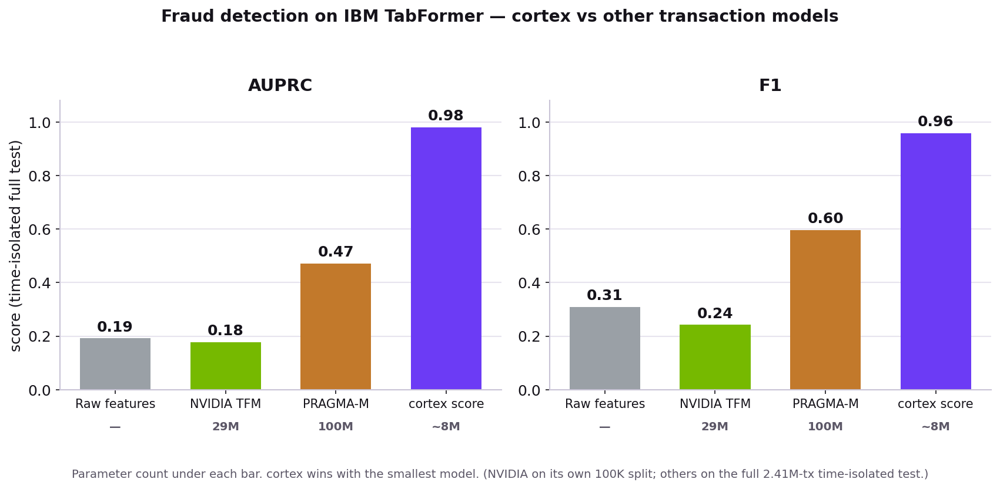
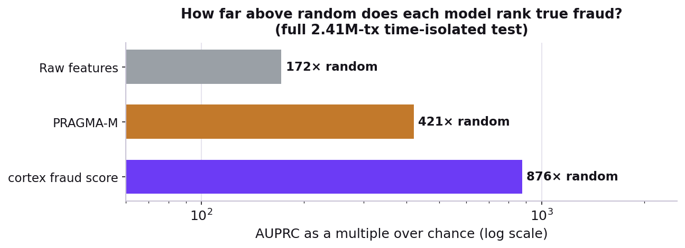
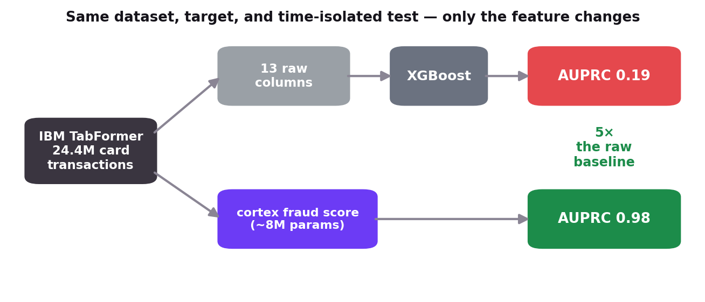

# NeoLDM Benchmark — Reproduce the Cortex Fraud Score

[](https://mybinder.org/v2/gh/neospace-ai/NeoLDMBenchmark/HEAD?labpath=cortex_score.ipynb)
[](https://colab.research.google.com/github/neospace-ai/NeoLDMBenchmark/blob/main/cortex_score.ipynb)
[](https://opensource.org/licenses/Apache-2.0)

Financial transaction data is one of the richest signals in the enterprise. Every swipe, transfer, and payment encodes a pattern of behavior — daily spending habits, and the subtle shifts that precede fraud. Traditional fraud systems lean on hand-crafted features and rules: brittle, slow to adapt, and blind to the deep sequential structure of a transaction history. **Transaction foundation models** change the equation — pretrained on raw, unlabeled transaction sequences, they learn general representations of financial behavior that transfer to downstream tasks like fraud detection.

**Cortex** is NeoSpace's transaction language model. It reads a raw stream of card transactions and emits a **per-transaction fraud score** — a calibrated probability — directly, with no downstream classifier. On the full IBM TabFormer test, held out by time (train 1991–2017, test 2018–2020), that score reaches **AUPRC 0.98 and F1 0.96** — far above the raw-feature baseline and the other transaction foundation models on the same task — from a **~8M-parameter** model, several times smaller than the models it beats.

This repository is a **runnable benchmark**: it downloads the published per-transaction Cortex scores and recomputes the time-isolated fraud metrics live, so the headline numbers can be verified rather than taken on trust. Launch it in your browser with the **Binder** badge above — no install, no login, no GPU.



> **How to read this:** fraud is ~0.11% of transactions, so a coin-flip classifier scores AUPRC ≈ 0.0011. The raw transaction columns reach ~170× that. Cortex's fraud score reaches **~875× random**. We report **AUPRC and F1** — at this prevalence AUROC saturates near 1.0 and can't separate good models from great ones.

---

## Software Components

**NeoSpace Technology**

- **Cortex** — NeoSpace's transaction language model; emits a calibrated per-transaction fraud score directly (~8M parameters). The per-transaction scores it produces over the full IBM TabFormer dataset are published at [embeddings.neospace.ai](https://embeddings.neospace.ai/) and consumed by this benchmark.

**3rd-Party Software**

- **scikit-learn** — AUPRC / precision-recall metrics for the evaluation
- **pandas** — dataframe interop while streaming the score shards
- **NumPy** — array operations for the score / label vectors
- **PyArrow** — reads the published Parquet score shards

> **Third-Party Software Notice.** This project downloads published Cortex scores derived from the IBM TabFormer dataset and installs third-party open-source packages. Review their respective license terms before use.

---

## Table of Contents

- [Quickstart](#quickstart)
- [Notebooks](#notebooks)
- [Run Locally](#run-locally)
- [What It Computes](#what-it-computes)
- [Model Architecture](#model-architecture)
- [Dataset](#dataset)
- [Prerequisites](#prerequisites)
- [License](#license)

---

## Quickstart

**Run it in your browser — no install, no GPU.** Two options:

- **[](https://mybinder.org/v2/gh/neospace-ai/NeoLDMBenchmark/HEAD?labpath=cortex_score.ipynb)** — **no login**. First launch builds the environment (~1–3 min; cached afterward).
- **[](https://colab.research.google.com/github/neospace-ai/NeoLDMBenchmark/blob/main/cortex_score.ipynb)** — faster, but **requires a Google login** to execute. Deps come pre-installed; the notebook fetches what it needs from this repo at runtime.

Then choose **Run ▸ Run All Cells**. The notebook downloads ~423 MB of published
scores from [embeddings.neospace.ai](https://embeddings.neospace.ai/) and computes
the time-isolated metrics in a few seconds. Peak memory stays around ~0.5 GB.

---

## Notebooks

| # | Notebook | Description |
|---|---|---|
| 1 | `cortex_score.ipynb` | Download the published per-transaction Cortex scores, recompute the fraud metrics on the full time-isolated IBM TabFormer test (AUPRC, F1, lift over random), and compare against the raw 13-feature XGBoost baseline. |

---

## Run Locally

If you'd rather run outside Binder:

```bash
git clone https://github.com/neospace-ai/NeoLDMBenchmark.git
cd NeoLDMBenchmark
pip install -r requirements.txt
jupyter notebook        # open cortex_score.ipynb and "Run All"
```

On first run the scores are fetched into `artifacts/scores/cortex_score/`
(git-ignored). The full computation peaks around **~0.5 GB of RAM** and takes a
few seconds once the data is downloaded.

**Remote host?** Forward the Jupyter port first —
`ssh -L 8888:localhost:8888 user@host` — then open the printed
`http://localhost:8888/?token=…` URL.

---

## What It Computes

The test set is the **entire** held-out split, isolated by time: train on
1991–2017, evaluate on **2018–2020 — 2.41M transactions, ~2,700 fraud (0.11%)**
— not a sample. Each row's fraud score is `P(fraud) = softmax(is_fraud_logits)[1]`.

| Model | Readout | Parameters | AUPRC | F1 |
|---|---|---:|---:|---:|
| Raw features | 13 columns → XGBoost | — | 0.19 | 0.31 |
| NVIDIA Transaction Foundation Model *(own split)* | embedding + raw → XGBoost | 29M | 0.18 | 0.24 |
| PRAGMA-M | embedding + raw → XGBoost | 100M | 0.47 | 0.60 |
| **Cortex** | **fraud score (no raw needed)** | **~8M** | **0.98** | **0.96** |

<sub>Every model is shown at its strongest configuration. Cortex's score is a
standalone detector — a calibrated per-transaction probability fed straight to
the metric, with no downstream classifier. Numbers are read from the committed
`results/fulltest_score.json`, so they never drift from the benchmark.</sub>



---

## Model Architecture

Cortex is a compact **transaction language model**: it reads each cardholder's
raw transaction sequence in its native bucketed format and models the
interactions *between* fields directly — the combinations (amount × merchant
type × hour × location) where fraud actually surfaces — rather than relating
fields only implicitly through general-purpose attention. Its output is a
**calibrated per-transaction fraud probability**, so the score *is* the
detector; there is no embedding-plus-classifier stack to build and maintain.

It reaches the strongest fraud detection on this benchmark while being the
smallest model by a wide margin:

| Model | Parameters |
|---|---:|
| **Cortex** | **~8M** |
| NVIDIA TFM (Llama decoder) | 29M |
| Revolut PRAGMA-M (encoder-only) | 100M |

That's ~4× smaller than NVIDIA's model and ~12× smaller than PRAGMA-M — the
result is the representation, not scale. Training Cortex is out of scope for
this benchmark repository; it reproduces the *evaluation* from the published
scores.



---

## Dataset

**IBM TabFormer** — Padhi et al., *Tabular Transformers for Modeling
Multivariate Time Series* ([arXiv:2011.01843](https://arxiv.org/abs/2011.01843),
[github.com/IBM/TabFormer](https://github.com/IBM/TabFormer)) — IBM's
**synthetic** credit-card transaction dataset: 24,386,900 transactions, 2,000
cardholders, 1991–2020, 0.11% fraud. Evaluated on a strict time-isolated 80/10/10
split (train 1991–2017, validation 2017–2018, test 2018–2020).

The raw CSV is not redistributed here (IBM TabFormer terms). This benchmark uses
only the **published per-transaction Cortex scores**
([embeddings.neospace.ai](https://embeddings.neospace.ai/)), which carry the
columns needed for evaluation: `timestamp__orig`, `is_fraud`, `is_fraud_logits`.

---

## Prerequisites

| Component | Requirement |
|---|---|
| Compute | CPU only — no GPU required |
| System RAM | ~2 GB (computation peaks ~0.5 GB) |
| Python | 3.10+ (Binder pins 3.11 via `runtime.txt`) |
| Network | ~423 MB download from `embeddings.neospace.ai` on first run |
| Dependencies | `pandas`, `numpy`, `pyarrow`, `scikit-learn` (see `requirements.txt`) |

---

## License

Unless otherwise noted, the contents of this repository are licensed under the
**Apache License, Version 2.0**.

The benchmark uses scores derived from the IBM TabFormer dataset, governed by
its own terms. Third-party packages are governed by their respective licenses.
